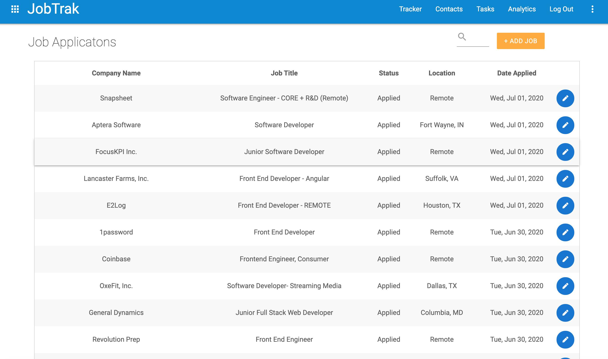

# JobTrak

## Overview

JobTrak is a Full Stack MERN application that allows the user to save and update information on job applications.

## Usage

JobTrak is deployed on Heroku. User must go to https://jobtrakr.herokuapp.com/ to view the app. The user will need to first create a login to enter. The user will then be taken to the home page where they can Add jobs to their database and also edit, update, or delete any applications. 

## Technologies
* JavaScript
* Node.js/Express
* MaterializeCSS
* MongoDB
* React.js

## Deployed
https://jobtrakr.herokuapp.com/ 

## Examples

## Test Account
User: Test
Password: test12345

## Ice Box
* Analytics section to show graphs and charts of application status data
* Contacts section to store contact information of Job contacts you have made
* Tasks section to keep track of daily and weekly items that need to be done

